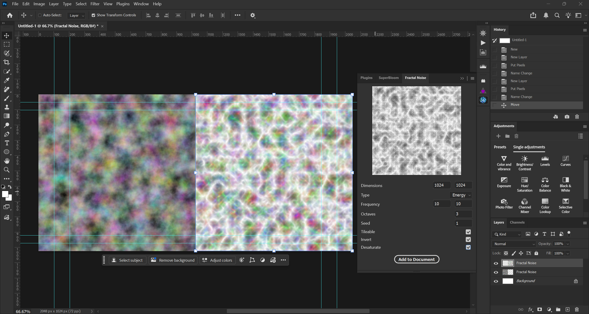

# Fractal Noise Plugin for Photoshop

Fractal Noise is a powerful tool for creating visual effects in softwares such as After Effects and Blender. But Photoshop's Clouds filter pales in comparison to the more advanced noise tools in these other softwares. Clouds offers almost no customization, making it virtually useless for actual artwork. This plugin aims to fill that gap by offering a more customizable fractal noise generator.

## Features

- Customizable size, frequency, and octaves
- Seed for reproducibility
- Seamless, tileable output
- Natural color variance (with options to invert and desaturate)

## Installation

> [Download from GitHub](https://github.com/yikuansun/photoshop-fractalnoise/releases/download/v1.0.0/996ca066_PS.ccx) (open the CCX file to install)

> [Download from Adobe Exchange](https://exchange.adobe.com/apps/cc/996ca066/fractal-noise-for-photoshop)

## Usage

1. Open the plugin panel (drag into dock for quick access)
2. Adjust the settings to your liking. You can type in the values or use the arrow keys to adjust them. Here is a brief description of each setting:
    - Dimensions: width and height of the output
    - Type: Clouds - standard cloudy noise; Energy - dynamic ridged noise
    - Frequency: scale the noise in the X and Y directions
    - Octaves: detail level (1 = smooth, 10 = rough)
    - Seed: random seed (positive integer)
    - Tileable: check to enable tileable output
    - Invert: check to invert the output
    - Desaturate: check to desaturate the output
3. Click the "Add to Document" button to add the noise into your document as a new layer

## License

This project is licensed under the MIT License - see the [LICENSE](LICENSE) file for details

## Contributing

Contributions are welcome! Feel free to open an issue or submit a pull request.
